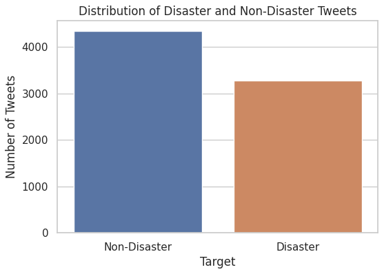
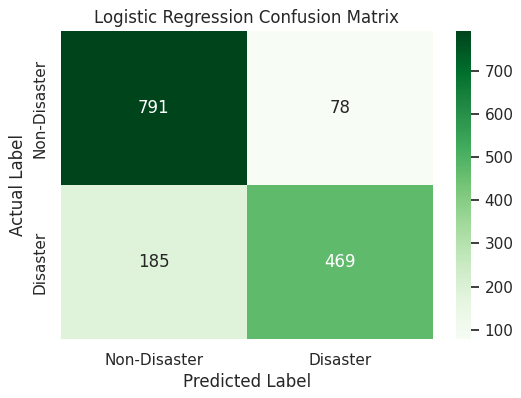
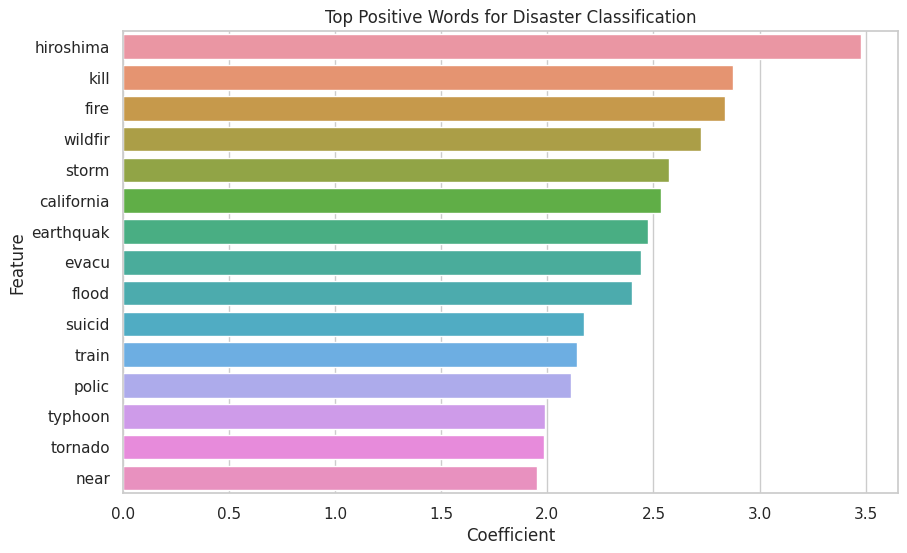
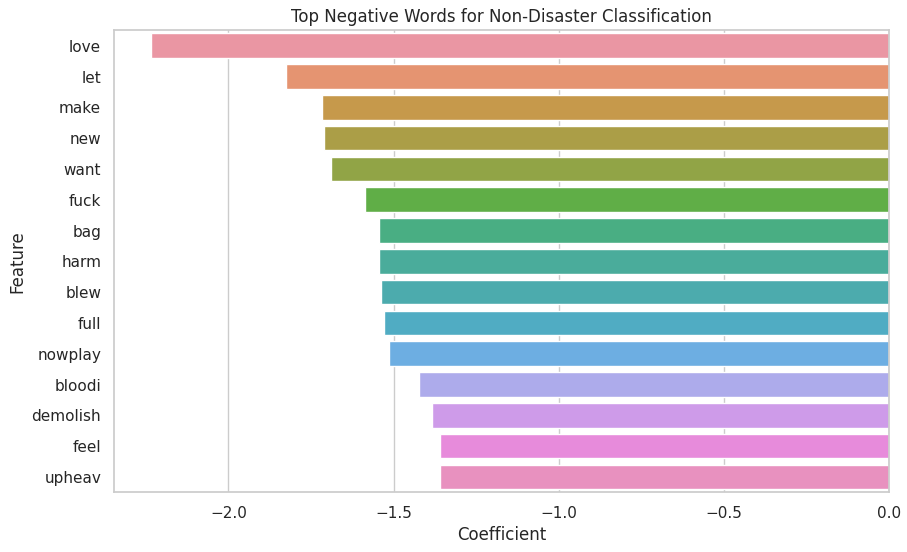

# Disaster Tweet Classification using Classical NLP

> **Project Revision Notice**<br>
> This project was originally created in May 2024 as part of my early NLP and machine learning journey. In May 2026, I revisited and rebuilt the project to improve the workflow, modelling pipeline, evaluation methodology, explainability, and business-oriented analysis.<br>
> The original notebook version is retained in this repository as a legacy reference.

## 📌 Project Overview

This project explores disaster tweet classification using classical Natural Language Processing (NLP) and machine learning techniques. The objective is to classify whether a tweet is related to a real disaster event or not based on its textual content.

The project was built using the Kaggle *Natural Language Processing with Disaster Tweets* dataset and focuses on creating an interpretable end-to-end NLP workflow using traditional machine learning approaches.

The workflow includes:<br>

* Exploratory Data Analysis (EDA)<br>
* Text preprocessing and cleaning<br>
* TF-IDF feature engineering<br>
* Baseline model comparison<br>
* Hyperparameter tuning<br>
* Model interpretation<br>
* Error analysis<br>
* Final Kaggle submission generation<br>

---

## 🎯 Business Problem

Social media platforms often become one of the fastest sources of information during natural disasters, emergencies, and crisis events. However, large volumes of noisy and informal text make it difficult to identify genuinely important content in real time.

This project demonstrates how machine learning can be used to automatically classify disaster-related tweets to support:

* Emergency response monitoring<br>
* Crisis detection systems<br>
* Social media intelligence pipelines<br>
* Public safety analytics<br>
* Early-stage alert systems<br>

---

## 📂 Dataset Information

Dataset Source:<br>
[Kaggle - Natural Language Processing with Disaster Tweets](https://www.kaggle.com/competitions/nlp-getting-started)

### Training Dataset

* Rows: 7,613<br>
* Columns: 5<br>
* Target Classes:<br>

  * `0` → Non-disaster tweet<br>
  * `1` → Disaster-related tweet<br>

### Dataset Characteristics

* Moderately balanced target distribution<br>
* Informal social media language<br>
* Contains hashtags, mentions, URLs, abbreviations, and slang<br>
* Includes noisy and context-dependent text patterns

---

## 🛠️ Technologies Used

### Programming Language

* Python

### Libraries

* pandas<br>
* numpy<br>
* matplotlib<br>
* seaborn<br>
* nltk<br>
* scikit-learn

### Machine Learning Techniques

* TF-IDF Vectorization<br>
* Multinomial Naive Bayes<br>
* Logistic Regression<br>
* GridSearchCV Hyperparameter Tuning

---

## 📊 Exploratory Data Analysis

The exploratory analysis revealed several useful patterns:

* Disaster-related tweets were generally longer on average.<br>
* Tweet text contained significant noise such as hashtags, mentions, and URLs.<br>
* Disaster keywords such as `wildfire`, `earthquake`, and `flood` appeared frequently in positive samples.<br>
* The dataset contained both literal and figurative disaster-related language.

### Target Distribution



---

## 🧹 Text Preprocessing

The text preprocessing pipeline included:

* Lowercasing text<br>
* Removing URLs<br>
* Removing user mentions<br>
* Removing punctuation and numbers<br>
* Tokenization<br>
* Stopword removal<br>
* Porter stemming

Example transformation:

| Original Text                                                    | Cleaned Text                                |
| ---------------------------------------------------------------- | ------------------------------------------- |
| Forest fire near La Ronge Sask. Canada                           | forest fire near rong sask canada           |
| 13,000 people receive #wildfires evacuation orders in California | peopl receiv wildfir evacu order california |

---

## 🤖 Model Development

Two classical machine learning models were evaluated:

| Model               | Accuracy | Precision | Recall | F1-Score |
| ------------------- | -------- | --------- | ------ | -------- |
| Logistic Regression | 0.8273   | 0.8574    | 0.7171 | 0.7810   |
| Naive Bayes         | 0.8188   | 0.8780    | 0.6713 | 0.7608   |
| Tuned Naive Bayes   | 0.8162   | 0.8696    | 0.6728 | 0.7586   |

### Key Observation

Logistic Regression achieved the strongest overall balance between precision, recall, and F1-score, making it the final selected model for inference and submission generation.

---

## 📈 Model Evaluation

### Logistic Regression Confusion Matrix



The Logistic Regression model demonstrated:

* Strong overall classification performance<br>
* Higher recall than Naive Bayes<br>
* Better balance between false positives and false negatives<br>
* More reliable disaster tweet detection

---

## 🔍 Model Interpretation

One advantage of Logistic Regression is interpretability through feature coefficients.

### Top Positive Words for Disaster Classification



Words such as:

* `hiroshima`<br>
* `wildfir`<br>
* `earthquak`<br>
* `flood`<br>
* `tornado`

were strongly associated with disaster-related tweets.

### Top Negative Words for Non-Disaster Classification



Words such as:

* `love`<br>
* `make`<br>
* `want`<br>
* `feel`

were more commonly associated with casual or non-disaster conversations.

---

## ⚠️ Error Analysis

The error analysis revealed several common NLP limitations:

* Figurative language and sarcasm confused the model.<br>
* Some tweets used disaster-related words in non-disaster contexts.<br>
* Context-dependent tweets remained difficult to classify correctly.<br>
* Traditional NLP models struggled with semantic understanding.

These observations highlight why more advanced transformer-based NLP models may outperform classical approaches in production environments.

---

## 🚀 Final Submission Workflow

The final Logistic Regression model was retrained using the full training dataset before generating predictions on the Kaggle test dataset.

The repository includes:

* Final inference pipeline<br>
* Kaggle submission workflow<br>
* `submission.csv` generation

---

## 📁 Repository Structure

```text
sentiment-analysis-naive-bayes-study/
│
├── notebooks/
│   ├── 00_legacy_2024_version.ipynb
│   ├── 01_data_loading_and_eda.ipynb
│   ├── 02_modeling_and_evaluation.ipynb
│   └── 03_final_model_and_submission.ipynb
│
├── images/
│   ├── target_distribution.png
│   ├── naive_bayes_confusion_matrix.png
│   ├── logistic_regression_confusion_matrix.png
│   ├── top_positive_disaster_words.png
│   └── top_negative_non_disaster_words.png
│
├── submission.csv
├── requirements.txt
├── .gitignore
├── LICENSE
└── README.md
```

---

## ⚙️ Installation

Clone the repository:

```bash
git clone https://github.com/myrazd/sentiment-analysis-naive-bayes-study.git
```

Install dependencies:

```bash
pip install -r requirements.txt
```

---

## 📌 Final Conclusion

This project demonstrates how classical NLP and machine learning techniques can still provide strong baseline performance for text classification tasks.

Beyond model training, the project also emphasizes:

* interpretable machine learning<br>
* evaluation tradeoff analysis<br>
* practical NLP preprocessing<br>
* model comparison workflows<br>
* business-oriented problem framing

Although transformer-based models would likely achieve higher performance, this project highlights the value of lightweight and explainable NLP pipelines that remain computationally efficient and easy to deploy.

---

## 📜 License

This project is licensed under the MIT License.
